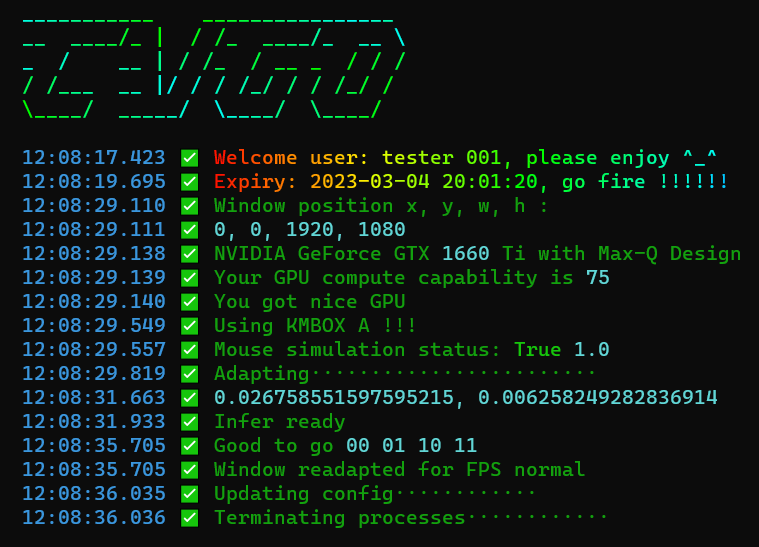
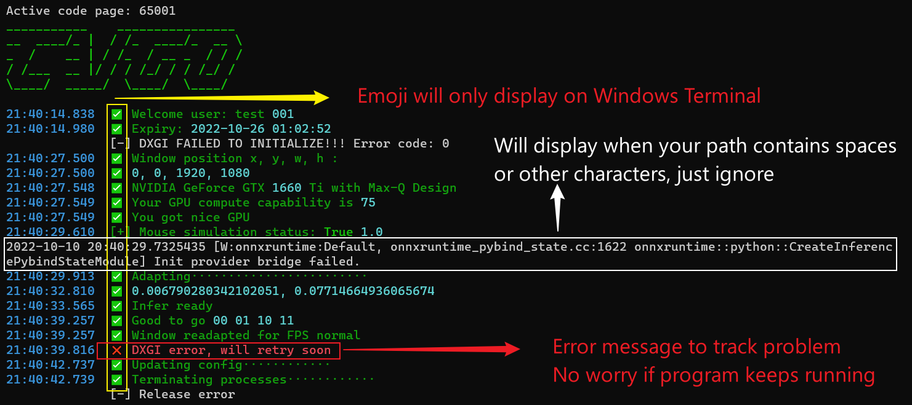
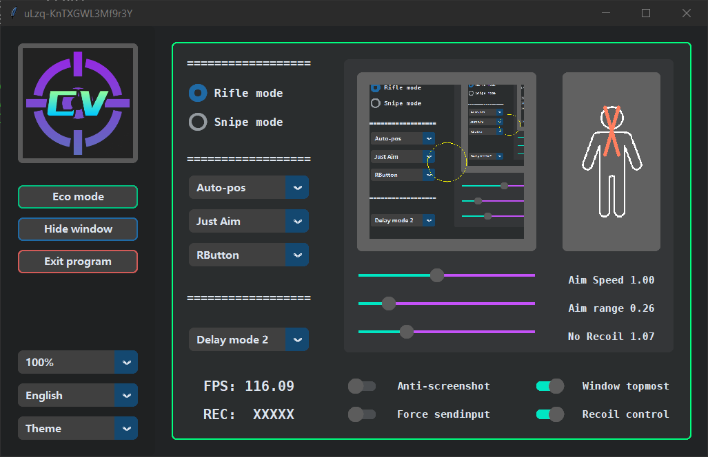
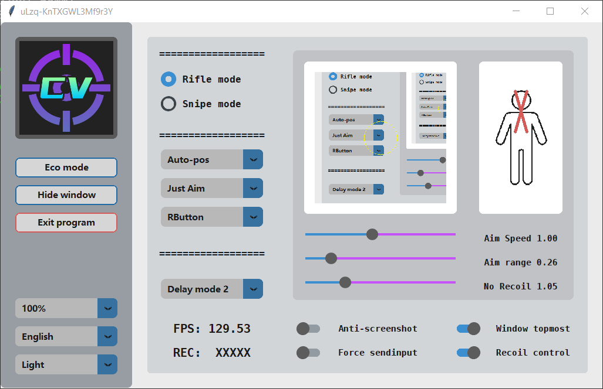
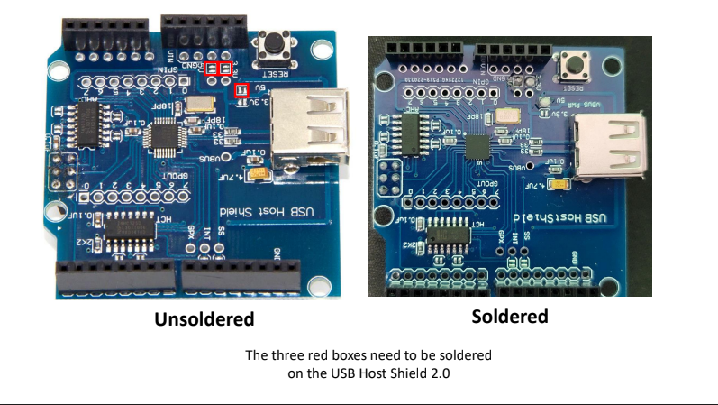

```
          _____                    _____                    _____                   _______
         /\    \                  /\    \                  /\    \                 /::\    \
        /::\    \                /::\____\                /::\    \               /::::\    \
       /::::\    \              /:::/    /               /::::\    \             /::::::\    \
      /::::::\    \            /:::/    /               /::::::\    \           /::::::::\    \
     /:::/\:::\    \          /:::/    /               /:::/\:::\    \         /:::/~~\:::\    \
    /:::/  \:::\    \        /:::/____/               /:::/  \:::\    \       /:::/    \:::\    \
   /:::/    \:::\    \       |::|    |               /:::/    \:::\    \     /:::/    / \:::\    \
  /:::/    / \:::\    \      |::|    |     _____    /:::/    / \:::\    \   /:::/____/   \:::\____\
 /:::/    /   \:::\    \     |::|    |    /\    \  /:::/    /   \:::\ ___\ |:::|    |     |:::|    |
/:::/____/     \:::\____\    |::|    |   /::\____\/:::/____/  ___\:::|    ||:::|____|     |:::|    |
\:::\    \      \::/    /    |::|    |  /:::/    /\:::\    \ /\  /:::|____| \:::\    \   /:::/    /
 \:::\    \      \/____/     |::|    | /:::/    /  \:::\    /::\ \::/    /   \:::\    \ /:::/    /
  \:::\    \                 |::|____|/:::/    /    \:::\   \:::\ \/____/     \:::\    /:::/    /
   \:::\    \                |:::::::::::/    /      \:::\   \:::\____\        \:::\__/:::/    /
    \:::\    \               \::::::::::/____/        \:::\  /:::/    /         \::::::::/    /
     \:::\    \               ~~~~~~~~~~               \:::\/:::/    /           \::::::/    /
      \:::\    \                                        \::::::/    /             \::::/    /
       \:::\____\                                        \::::/    /               \::/____/
        \::/    /                                         \::/____/                 ~~
         \/____/
```
# 🚀🚀🚀𝒀𝑶𝑳𝑶𝒗 𝑽/𝑽𝑰/𝑽𝑰𝑰/𝑿 𝒃𝒂𝒔𝒆𝒅 𝒂𝒊𝒎 𝒂𝒔𝒔𝒊𝒔𝒕

<details>
<summary>CMD more explanation</summary>

* 
</details>
<details>
<summary>Dark theme (click to show)</summary>

* Current dark theme (with eco mode on) 
</details>
<details>
<summary>Light theme (click to show)</summary>

* Current light theme 
</details>

<br/><br/>

## 📝📝📝Note:
* If you want to use GHUB mouse simulation method, you MUST use old version of GHUB driver (older than 2022.03), or use LGS instead, or use provided [patch](https://www.reddit.com/r/LogitechG/comments/ltovos/how_to_install_old_ghub_works_no_auto_update/) to reverse back GHUB version
* **Password is provided through #ticket of my Discord server**
* Don't include "ID: " or "KEY: " when entering...... But need to include that "key/" which is not capitalized
* Arduino code not work for all mouses (this one supports most mouses include Logitech and Razer), need to be modified if not working well
* You MUST test turn around data using [turn_around.exe](Test_turn_around/turn_around_ex.exe) first and every time after you changed mouse sensitivity settings, and [here](https://www.youtube.com/watch?v=yOcmX9fnZJk) is how to use it


<br/><br/>

## 🎈🎈🎈Promotion:
* Join **[Discord](https://discord.gg/XGhacSc779)**, read information and create ticket
* AIMBOT IS NOT free, join the server for details (please read), but I will also release a free version
* There is a FREE weights shared previously for people who want to code their own program. Enjoy. (class 0: head; class 1: body, 416*416, Yolov4-tiny)
* Also a slightly modified version of [labelimg](Free_stuffs/labelImg_cx.exe), with zoom up to 1000% and no fuzzy, better for moving tiny labels
* Proof of [work on YouTube](https://www.youtube.com/watch?v=v1kzhw9tZ18)
* BE A PRO IN CSGO/CROSSFIRE/VALORANT/APEX/NZ/PUBG & so on !!!
* QQ Group 778907895

<br/><br/>

## 🖱️🖱️🖱️External hardware:
<details>
<summary>Arduino Leonardo + USB host shield</summary>

* External hardware (Arduino Leonardo + USB host shield) can be purchased at [Amazon - Arduino Leonardo](https://www.amazon.com/KEYESTUDIO-Leonardo-Development-Board-Arduino/dp/B0786LJQ8K/) and [Amazon - USB host shield](https://www.amazon.com/ARCELI-Shield-Arduino-Support-Android/dp/B07J2KKGZ4/) or [Ebay - USB host shield](https://www.ebay.com/itm/393311967986), and here is a [video](https://www.youtube.com/watch?v=1dxwU87GQVM) shows how you should install them
* If you choose to use Arduino, do realize that you need to solder those three lacations 
</details>

<br/><br/>

## 📆📆📆Upcoming:
* ⭕Tutorial
* ⚠Using TRT to boost speed (done, planned to add only in pro version, done, evaluating, seems not necessary)
* ✅Using new "nice-looking" gui (Done)
* ✅Safer version which pure relies on python.exe (Done)
* ✅Support Arduino Leonardo + USB host shield (Done)
* ⚠Hide process from task manager (Done, test not safe)
* ⭕Better weights for Valorant and PUBG (Delayed)
* ✅Accurate recoil control for some games (Done for CSGO, available only in pro version)
* ⭕Players can download at different time will get different files (with same file names but content changed)
* ✅[Free version](https://github.com/JiaPai12138/AI-M-BOT)
* ⭕More organized gui

<br/><br/>

## 👍👍👍Features:
* Different checksum for different user
* One program works on many fps games
* Light weight YOLO AIMBOT with fantastic performance (low GPU usage)
* Well-trained models
* Does not read/write memory, no virus and fill free to scan (except for ESET which take all packers as potential virus)
* Smooth human-like mouse move at all FPS values, random speed of mouse clicks
* Custom shortcut keys, custom mouse move speed, custom aiming positions, various supported battle modes
* Standalone RCS for CSGO
* Enhanced object tracking using PID system (optimized for both static and moving targets)
* Support different types of mouse simulation to bypass *** platforms
* Welcome to try with your secondary accounts, see the facts with your own eyes without losing and regretting

<br/><br/>

## 🖥️🖥️🖥️Hardware requirements:
- GPU requirement (one of the following)
  - NVIDIA Kepler (GTX 600 series) and above
  - AMD GCN 1st Gen (Radeon HD 7000 series) and above
  - Intel Haswell (4th-gen core) HD Integrated Graphics and above
  - Qualcomm Adreno 600 and above
- CPU requirement (recommendations)
  - Anything better than i7-4700MQ
  - 8th generation and later for Intel cpu
```
DirectML was introduced in Windows 10, version 1903, and in the corresponding version of the Windows SDK.
```
